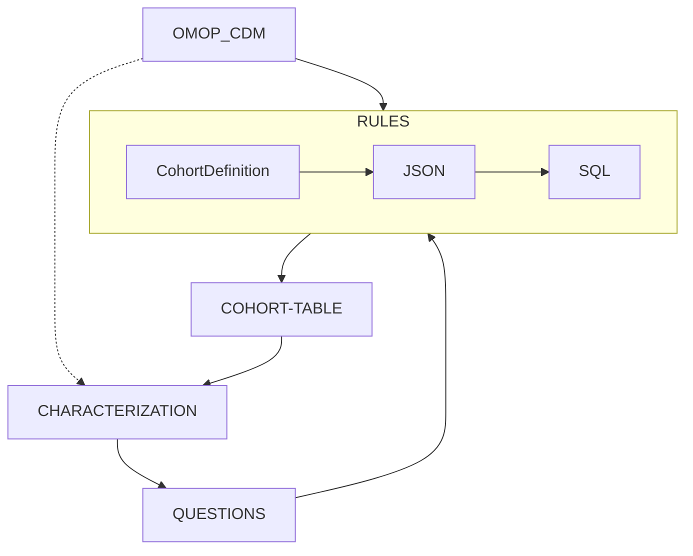
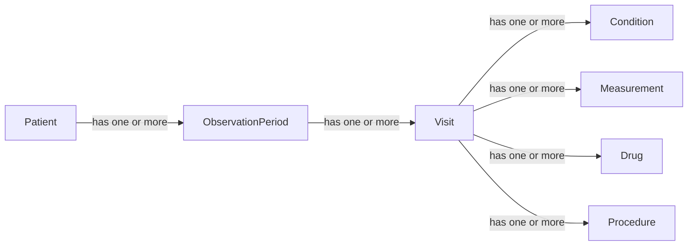
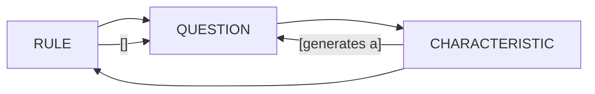

# Phenotyping 

## Rule based phenotype building loop

Person level data is stored in a database of any dialect (postgreSQL, MySQL, etc.) that follows the OMOP common data model (CDM). 

A set of RULES are defined in a standardised JSON file that is translated in to the target dialect SQL.

Using https://github.com/OHDSI/circe-be or https://github.com/OHDSI/CirceR 

The SQL query results in the COHORT-TABLE. A table with 3 colums: patients ID, StartDate, EndDate. 

The characteristics of this group patients are extracte from the OMOP-CDM. Eg sex distribution, age of onset, commorbidities, common drugs used, ...

The characteristis help to generate new QUESTIONS that can be used to refine the RULES, as well as confirm the RULES have had an effect. 

### OMOP CDM

This is a standard database 

In a nutshell

In details

https://ohdsi.github.io/CommonDataModel/cdm54.html#Clinical_Data_Tables

### COHORT 
 In the OHDSI context:

> A cohort is a group of persons who satisfy one or more specified criteria for a period of time.

Example cohort table:

| person_id | cohort_start_date | cohort_end_date |
|-----------|------------------|----------------|
| 1001      | 2020-01-15       | 2021-01-15     |
| 1002      | 2019-06-10       | 2020-06-09     |
| 1003      | 2020-01-15       | 2021-01-15     |
| 1003      | 2021-03-22       | 2022-03-21     |
| 1004      | 2021-03-22       | 2022-03-21     |

A person_id can be more than once but with not overlaping time periods

#### Example Cohorts

1. **Type 2 Diabetes Mellitus Cohort**
    - Persons with at least two diagnosis codes for Type 2 Diabetes (ICD-10: E11) within a 1-year period.
    - Entry: First diagnosis date.
    - Exit: End of observation period.

2. **Pregnacy time**
    - A person can be more than once but with not overlapping time periods.
    - Entry: 9 months before the delivery.
    - Exit: delivery date.

3. **Drug Utilization**
    - Persons who receive a prescription for a specific drug or drug class. A person can be more than once with not overlaping periods
    - Entry: Date of first prescription.
    - Exit: Discontinuation of medication or end of observation period.

### RULES

In the OHDSI contex this phenotype rules are called `Cohort Definition`

Are divided in 3 groups 

a. **One Cohort Entry**
Defines the initial list of persons_id and cohort_start_date

b. **Zero or more Inclusion Rules**
Multiple rules to remove persons_id from the cohort table

Inclusion rules can be

- **Absolute** they apply to hole patients life. E.g., Sex, exclude if having commorvidity X, etc 
- **Relative** relative to the cohort_start_date. E.g., Having Procedure Px before the onset date,  

c. **One Cohort Exit**
Defines cohort_start_date

By default is the end of observation (end of follow-up)

#### Sub Question
A subquestion to each of these rules is : 

For a medical concept (Drug, Diagnose, Procedure, ...), what are the structured medical codes that define that medical concept. 

They say to have solved this in a up comming package 
- https://github.com/OHDSI/Phenelope

Combines previus approaches: 
- Semantic search of concept https://github.com/OHDSI/Hecate
- Correlated concepts : https://www.ohdsi.org/2022showcase-6/

### CHARACTERIZATION

Ohdsi uses CohortDagnostics, we use CohortOperations. 

- Sex distribution
- Most common medical codes (drug, condition, procedure, ...) used by the cohort
- Most common medical codes use by the cohort in time windows relative to the cohort entry 

### QUESTIONS

## Phenotype Evaluation 
Once the cohort definition is defined, we can evaluate how good it captures the intended population using various methods. 

The perfect ground true would be that a Medical Expert that evaluates all the patients history in the database and determines who and when they are in the cohort. As this is impractical, we use other methods to approximate the ground truth.

### Chart Review
A group of medical experts manually reviews a sample of patient records to determine if they meet the cohort criteria. 
This method provides a high-quality reference standard but is time-consuming and expensive.

### Keeper
https://github.com/OHDSI/Keeper
Is a tool that aims to automate chart review by using LLMs.

Given the cohort table, it takes a subsample of patients N. For each sample patient extrac personal level medical characteristics. Ask an LLM how likely is that person to belong to the Cohort given the extracted characteristics. 

The personal level characteristics can be defined by an expert or by an LLM. 

### Phevaluator
https://github.com/OHDSI/PheValuator

It uses machine learning to give a probability between 0 and 1 for each patient, indicating the likelihood of belonging to a cohort, Silver Standard. Then the binary results of the cohort definition are compared against these probabilities to calculate sensitivity, specificity, and PPV.

## Phenotype Scoring 

We had made a weird mix of all the above 

- We do the phenotype building loop . But it has limitations.
- we create a probavilistic cohort similar to phevaluator rather than rule based

# Ideas 

Opinions:
- IMO, many of the limitations in all this process are due to technical tool development which are solved now by agents
- I think rule base is better than the score. Score can be abviguos, a person that goes more to doctor gets more codes, howmuch does it weith to take a drug, ...
- The ideas of a score can still be done in the rule base cohort

Ideas:

- Break the building process into a series of QUESTIONS
- Each QUESTION can be generated either from medical knowlege or from the patient characteristics
- Each QUESTION has a clear equivalent RULE
- Each RULE has a clear effect on one CHARACTERISTIC 
- A CHARACTERISTIC can be used to generate a new QUESTION that is translated into a RULE
- A RULE can be evaluated using the CHARACTERISTICS to determine its 

Example 

QUESTION: Does the condition only apply to males?
RULE: Inclusion criteria, include only patietns with sex=8240
CHARACTERISTIC: Sex Distribution 99% Male

RULESET:
- RULE1

Ask the llm medical expert to add more questions based on the 

RULESET:
- RULE1
- RULE2 : 
