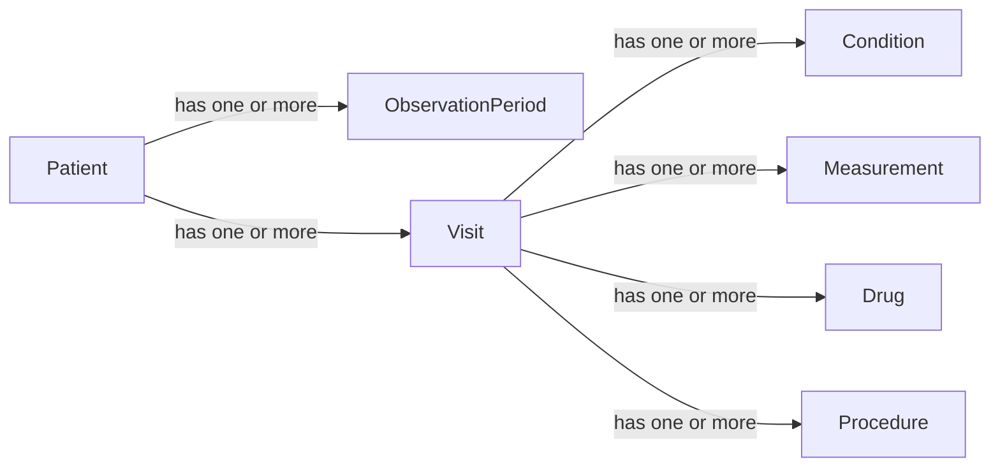

# Phenotyping 

## Rule based phenotype building workflow

```mermaid
flowchart LR
	Patient -->|has one or more| ObservationPeriod
	Patient -->|has one or more| Visit
	Visit -->|has one or more| Condition
	Visit -->|has one or more| Measurement
	Visit -->|has one or more| Drug
	Visit -->|has one or more| Procedure
```